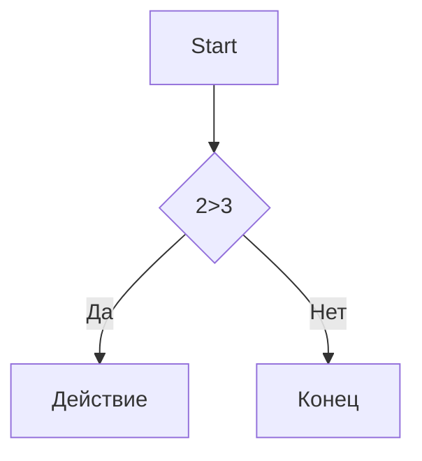

# Заговолок 1
## Заговолок 2
### Заговолок 3
#### Заговолок 4
##### Заговолок 5
###### Заговолок 6

Выделение текста
----------------

**курсив** _Курсив_ 
**Жирный** __Жирный__ 
***Жирный и курсив***/ __ Жирный и курсив__

~~Зачеркнутый~~

`моноширный`


Списки
------
- Пункт 1
- Пункт 2 
  - Вложенный
  - ещё
 * Пункт 3
 + Пункт 4
1. Первый
2. Второй
3. Третий
   1. Вложенный
   2. Ещё


- [x] 1
- [ ] 2
- [ ] 3

[текст ссылки](https://example.com)

[С подсказкой](https://example.com "При наведении")

<https://auto-link.com> 

[Ссылочный стиль][1]

[1]:https://example.com


Цитата
-----

>Цитата
>Много строк
> > Не мы такие, жизнь такая

Код
---
```markdown
print("Hello") Python
```


```python
c = a+b
print(f"{c} = {a} + {a} + {b}")
```

Таблицы
-------

| Name | Age | City |
|-----:|:---:| :----|
|SS    | 34  | MOd  |
|SS    | 34  | MOd  |
|SS    | 34  | MOd  |
|SS    | 34  | MOd  |
|SS    | 34  | MOd  |
|SS    | 34  | MOd  |
|SS    | 34  | MOd  |
|SS    | 34  | MOd  |
|SS    | 34  | MOd  |
|SS    | 34  | MOd  |


Линии
-----

---
***

___


fdfd
Цитата
------

>Цитата
>Много строк
>
> > Вложенная

Код
---

```markdown
print("Hello") Python
```

```python
c = a+b
print(f"{c} = {a} + {b}")
```

Таблицы
-------
 ---: = ориентация справа
 
 :---: ориентация по центру
 
 :--- = ориентация слева
 
| Name | Age | City      |
|-----:|:---:|:----------|
|SS    |34   |   MOd     |
|SS    |34   |   MOd     |
|SS    |34   |   MOd     |
|SS    |34   |   MOd     |
|SS    |34   |   MOd     |
|SS    |34   |   MOd     |

Линии
-----

---
***
___


Экранирование
-------------

\# 

\[ dsdssd \]

Диаграмма
---------



Заголовки
---------

- [Заголовки](#1-заголовки)
- [Списки](#3-списки)
